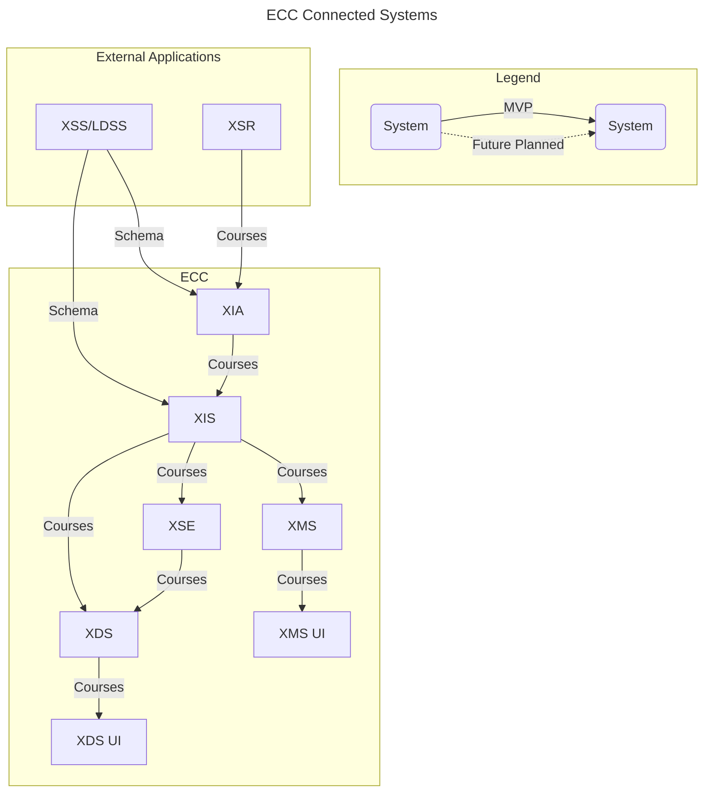

# OpenLXP - Experience Search Engine (XSE)

XSE works to streamline the search capabilities relied upon by Experience Discovery Service ([XDS](https://github.com/adlnet/ecc-openlxp-xds)). The Experience Indexing Service ([XIS](https://github.com/adlnet/ecc-openlxp-xis)) loads records into XSE (assumed to be Elasticsearch).

This repository contains an example docker-compose in order to deploy an Elasticsearch cluster for the OpenLXP platform. For local testing it is recommended that the user simply uncomment the `eso1` instance defined in the XIS docker-compose ([eso1](https://github.com/adlnet/ecc-openlxp-xis/blob/7658d87a6b863eaf21bf1580a20ec682e8616ee3/docker-compose.yml#L57))


## ECC System Architecture




## Intended use

Intended use of this is that a user could reference this architecture as boilerplate to stand-up a search engine for their learning experience platform on OpenLXP.

## Prerequisites
### Install Docker & docker-compose
#### Windows & MacOS
- Download and install [Docker Desktop](https://www.docker.com/products/docker-desktop) (docker compose included)


#### Linux
You can download Docker Compose binaries from the
[release page](https://github.com/docker/compose/releases) on this repository.

Rename the relevant binary for your OS to `docker-compose` and copy it to `$HOME/.docker/cli-plugins`

Or copy it into one of these folders to install it system-wide:

* `/usr/local/lib/docker/cli-plugins` OR `/usr/local/libexec/docker/cli-plugins`
* `/usr/lib/docker/cli-plugins` OR `/usr/libexec/docker/cli-plugins`

(might require making the downloaded file executable with `chmod +x`)

## Clone the project
Clone the Github repository
```
git clone https://github.com/adlnet/ecc-openlxp-xse.git
```  

## Deployment
1. Create the elastic docker network
    Open a terminal and run the following command in the root directory of the project.
    ```
    docker network create elastic
    ```

2. Run the command below to deploy XSE from `docker-compose.yaml` 
    ```
    docker-compose up -d --build
    ```
## Further resources

For more details on Elasticsearch, please refer to the following documentation:
* [Elasticsearch - What is Elasticsearch](https://www.elastic.co/guide/en/elasticsearch/reference/7.11/elasticsearch-intro.html)

## Additional Documentation
[ECC-Openlxp Wiki can be found here](https://github.com/adlnet/ecc-openlxp-xds-ui/wiki)

## License
This project uses the [Apache](http://www.apache.org/licenses/LICENSE-2.0) license.
